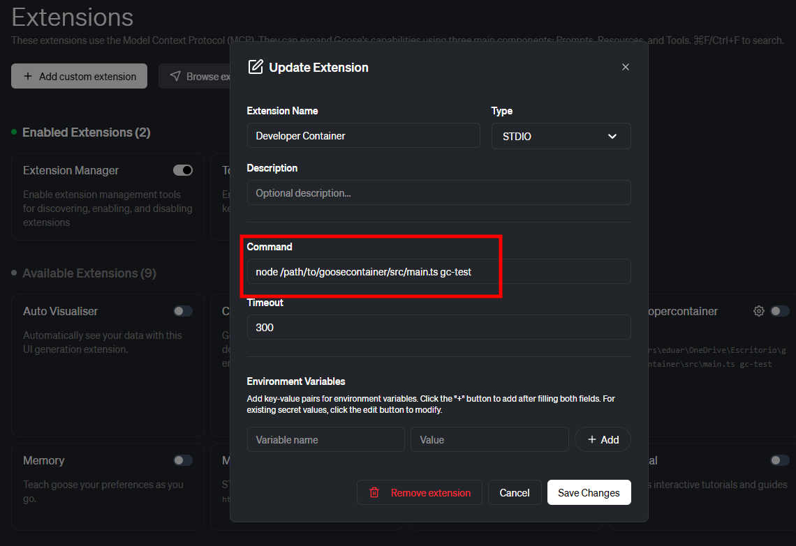

# Goose Developer For Containers

Container integration for Goose via developer MCP

## What it does

This tool enables running Goose MCP developer inside Docker containers. It automatically:

1. Finds a running container by name or ID
2. Installs required dependencies (wget, libxcb1, bzip2)
3. Downloads and installs the Goose binary
4. Executes `goose mcp developer` inside the container

**Note:** Currently only works with Debian and Ubuntu-based containers.

## Installation

It requires Node.js v22.18 or higher.

1. Clone the repository:

```bash
git clone https://github.com/eduardolat/goosecontainer.git
```

2. Navigate to the project directory:

```bash
cd goosecontainer
```

3. Install dependencies:

```bash
npm install
```

## Configuration

To use this project with Goose, configure Goose and add a new STDIN extension with the following command:

```bash
node /path/to/goosecontainer/src/main.ts <container-name-or-id>
```

The tool will copy the installation script into the container and execute it, providing an interactive Goose MCP developer session.

## Example

To test the tool, you can start a test container:

```bash
docker run --rm -it --name gc-test debian bash
```

Then, in goose create and activate a new stdin extension with the following command:

```bash
node /path/to/goosecontainer/src/main.ts gc-test
```


